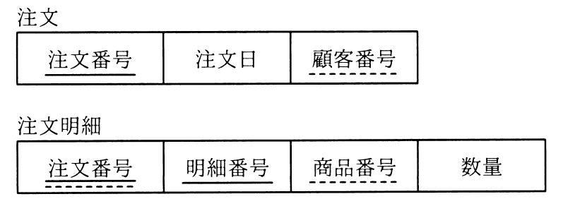

# 秋期 問27（技術要素）

## 問題文

図のような関係データベースの“注文”表と“注文明細”表がある。“注文”表の行を削除すると，対応する“注文明細”表の行が，自動的に削除されるようにしたい。SQL文のON DELETE句に指定する語句はどれか。ここで，図中の実線の下線は主キーを，破線の下線は外部キーを表す。

ア　CASCADE

イ　INTERSECT

ウ　RESTRICT

エ　UNIQUE

## 使用画像

## 解答と解説

**正解：ア**

画像の通り、“注文明細”表の「注文番号」は“注文”表の主キーを参照する外部キーである。参照元（親）である“注文”表の行を削除したとき、それを参照する“注文明細”表の対応する行を自動的に連動して削除させるには、外部キー制約定義時のON DELETE句に「CASCADE」を指定する。CASCADEは親行の削除・更新を子行に連鎖（cascade）させる指定である。

- イ：INTERSECTは集合演算子（積集合）であり、ON DELETE句に指定する選択肢ではない。
- ウ：RESTRICTは、参照している子行が存在する場合に親行の削除を禁止（制限）する指定であり、自動削除ではなく削除を拒否する動作になるため、要件と逆である。
- エ：UNIQUEは列の一意性制約を表すキーワードであり、ON DELETE句の動作指定とは無関係。

以上より、親行削除時に子行も連動して自動削除するにはCASCADEを指定するアが正解である。

**IPA公式：ア**
