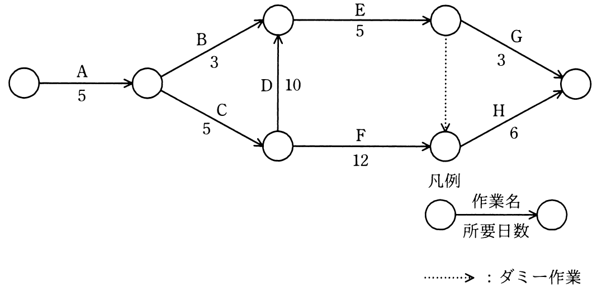

# 秋期 問52（マネジメント）

## 問題文

アローダイアグラムで表される作業A〜Hを見直したところ，作業Dだけが短縮可能であり，その所要日数は6日に短縮できることが分かった。作業全体の所要日数は何日短縮できるか。

ア　1

イ　2

ウ　3

エ　4

## 使用画像

## 解答と解説

**正解：ウ**

図の各経路の所要日数を計算する。開始→（A=5）→分岐点1→（B=3 または C=5）→…→（D=10でC側からB側の合流点へ）→（E=5）→…（ダミー=0）→（F=12）→…→（G=3 または H=6）→終了、という構造である。

各節点への最早開始日を計算すると次のとおり。
- 分岐点1（A後）：5
- 分岐点2（C後）：5+5=10
- 合流点（B or C+D）：max(5+3, 10+10)=20
- E後：20+5=25
- F後（C+F）：10+12=22
- 合流（E後 or F後経由ダミー）：max(25, 22)=25（ダミーはE後の25を引き継ぐ）
- 終了：max(25+3(G), 25+6(H))=31

したがって当初の全体所要日数は31日で、クリティカルパスは A→C→D→E→ダミー→H（5+5+10+5+0+6=31）である。作業Dを6日に短縮すると、合流点はmax(5+3, 10+6)=16、E後=16+5=21、終了=max(21+3, 21+6)=27日となる。ただしF経由の経路（A+C+F+H=5+5+12+6=28）が新たなクリティカルパスとなるため、全体所要日数は28日となる。31−28＝3日短縮できるので、ウが正解。

**IPA公式：ウ**

