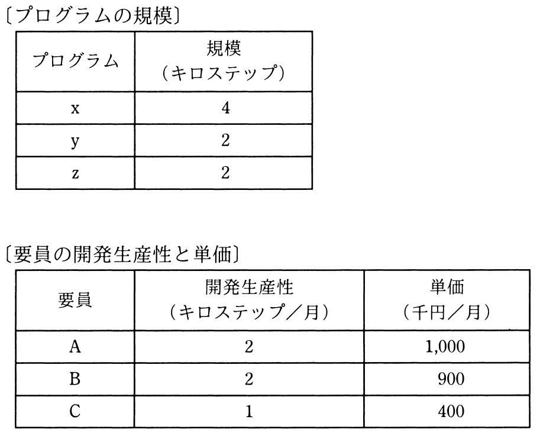

# 秋期 問54（マネジメント）

## 問題文

プログラムx，y，zの開発を2か月以内に完了したい。外部から調達可能な要員はA，B，Cの3名であり，開発生産性と単価が異なる。このプログラム群を開発する最小のコストは，何千円か。ここで，各プログラムの開発は，それぞれ1名が担当し，要員は開発生産性どおりの効率で開発できるものとする。また，それぞれの要員は，担当したプログラムの開発が完了する時点までの契約とする。

ア　3,200

イ　3,400

ウ　3,600

エ　3,700

## 使用画像

