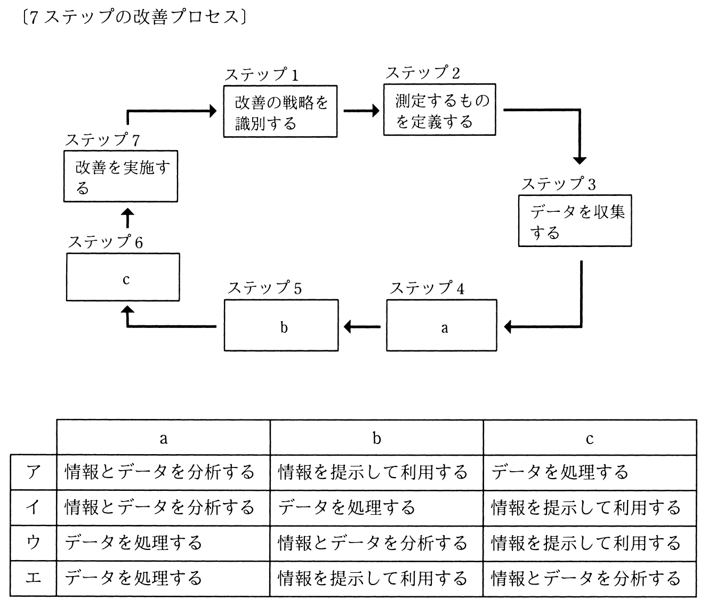

# 秋期 問56（マネジメント）

## 問題文

ITIL 2011 editionによれば，7ステップの改善プロセスにおけるa，b及びcの適切な組合せはどれか。

## 使用画像

## 解答と解説

**正解：ウ**

画像に示された「7ステップの改善プロセス」は、ITIL 2011 editionの継続的サービス改善（CSI）における標準的な流れであり、以下の順序で構成される。

ステップ1：改善の戦略を識別する→ステップ2：測定するものを定義する→ステップ3：データを収集する→ステップ4：データを処理する（a）→ステップ5：情報とデータを分析する（b）→ステップ6：情報を提示して利用する（c）→ステップ7：改善を実施する。

すなわち、収集した生データをまず「処理」して整理し（a=データを処理する）、それを「分析」して知見を導き出し（b=情報とデータを分析する）、その結果を「情報として提示・活用」する（c=情報を提示して利用する）という流れになる。これはウの組合せ（a：データを処理する、b：情報とデータを分析する、c：情報を提示して利用する）と一致する。

**IPA公式：ウ**

