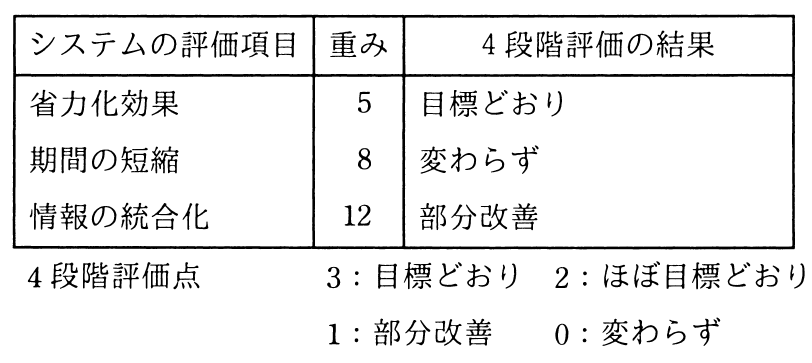

# 秋期 問64（ストラテジ）

## 問題文

定性的な評価項目を定量化するために評価点を与える方法がある。表に示す4段階評価を用いた場合，重み及び4段階評価の結果から評価されたシステム全体の目標達成度は，評価項目が全て目標どおりだった場合の評価点に対し，何％となるか。

ア　27

イ　36

ウ　43

エ　52

## 使用画像

## 解答と解説

**正解：イ**

表より、各評価項目の重みは「省力化効果：5」「期間の短縮：8」「情報の統合化：12」である。全項目が目標どおり（4段階評価点：3）だった場合の満点は、(5+8+12)×3 = 75点となる。

実際の評価結果は、省力化効果が「目標どおり」＝3点、期間の短縮が「変わらず」＝0点、情報の統合化が「部分改善」＝1点である。これを重みで加重すると、
5×3 + 8×0 + 12×1 = 15 + 0 + 12 = 27点

したがって、目標達成度は 27 ÷ 75 × 100 ≒ 36％ となり、イが正解である。

**IPA公式：イ**

