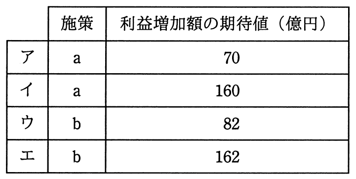

# 秋期 問74（ストラテジ）

## 問題文

ビッグデータ分析の手法の一つであるデシジョンツリーを活用してマーケティング施策の判断に必要な事象を整理し，発生確率の精度を向上させた上で二つのマーケティング施策a，bの選択を行う。マーケティング施策を実行した場合の利益増加額（売上増加額−費用）の期待値が最大となる施策と，そのときの利益増加額の期待値の組合せはどれか。

## 使用画像

## 解答と解説

**正解：ウ**

デシジョンツリー（決定木）による期待値計算では、各分岐点で発生確率を掛けて期待値を求め、意思決定の分岐点（□）では選択可能な選択肢のうち期待値が最大となる方を採用する。

**施策a（初期費用30億円）**
- 追加費用60億円を投入した場合の期待売上増加額：0.3×200+0.7×100=60+70=130億円。ここから追加費用60億円を差し引くと130−60=70億円。
- 追加費用なしの場合：50億円（確定）。
- 意思決定点では大きい方の70億円を選択。
- 発生確率0.4の枝の期待値＝70億円、発生確率0.6の枝＝120億円。
- 全体の期待売上増加額＝0.4×70+0.6×120=28+72=100億円。初期費用30億円を差し引き、利益増加額の期待値＝100−30＝70億円。

**施策b（初期費用40億円）**
- 追加費用40億円を投入した場合：0.4×150+0.6×100=60+60=120億円。追加費用40億円を差し引くと120−40=80億円。
- 追加費用なしの場合：70億円（確定）。
- 意思決定点では大きい方の80億円を選択。
- 発生確率0.3の枝の期待値＝80億円、発生確率0.7の枝＝140億円。
- 全体の期待売上増加額＝0.3×80+0.7×140=24+98=122億円。初期費用40億円を差し引き、利益増加額の期待値＝122−40＝82億円。

施策aは70億円、施策bは82億円であり、施策bの方が期待値が大きいため、施策bを選択し期待値82億円となる組合せ、すなわち選択肢ウが正しい。

**IPA公式：ウ**

