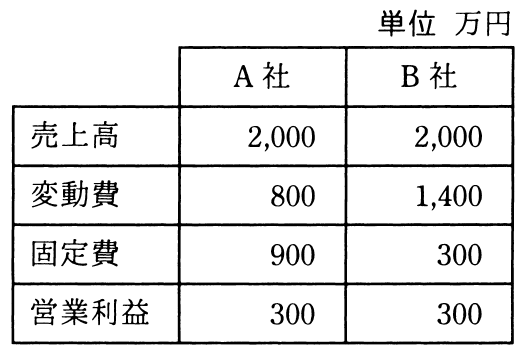

# 秋期 問77（ストラテジ）

## 問題文

損益分岐点分析でA社とB社を比較した記述のうち，適切なものはどれか。

ア　安全余裕率はB社の方が高い。

イ　売上高が両社とも3,000万円である場合，営業利益はB社の方が高い。

ウ　限界利益率はB社の方が高い。

エ　損益分岐点売上高はB社の方が高い。

## 使用画像

## 解答と解説

**正解：ア**

画像の損益データ（単位：万円）から、両社の限界利益率・損益分岐点売上高・安全余裕率を計算する。

**A社**：売上高2,000、変動費800、固定費900、営業利益300
- 限界利益率＝(2,000−800)／2,000＝60%
- 損益分岐点売上高＝固定費／限界利益率＝900／0.6＝1,500万円
- 安全余裕率＝(2,000−1,500)／2,000＝25%

**B社**：売上高2,000、変動費1,400、固定費300、営業利益300
- 限界利益率＝(2,000−1,400)／2,000＝30%
- 損益分岐点売上高＝300／0.3＝1,000万円
- 安全余裕率＝(2,000−1,000)／2,000＝50%

以上より、安全余裕率はA社25%、B社50%でB社の方が高く、選択肢アは正しい。

- イ：売上高3,000万円時の営業利益は、A社＝3,000×0.6−900＝900万円、B社＝3,000×0.3−300＝600万円となりB社の方が低いため誤り。
- ウ：限界利益率はA社60%、B社30%でA社の方が高いため誤り。
- エ：損益分岐点売上高はA社1,500万円、B社1,000万円でA社の方が高いため誤り。

**IPA公式：ア**

