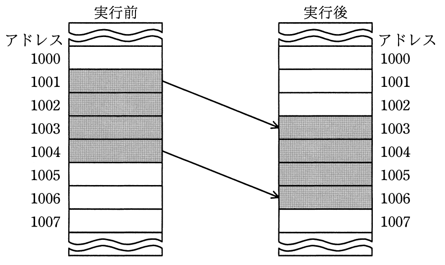
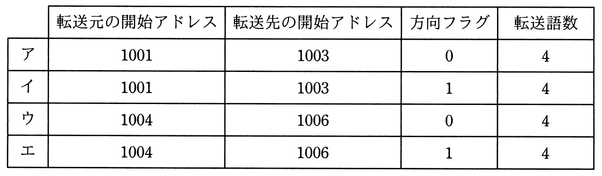

# 平成31年度春期 問9（コンピュータシステム）

## 問題文

同一メモリ上で転送するとき，転送元の開始アドレス，転送先の開始アドレス，方向フラグ及び転送語数をパラメタとして指定することによってブロック転送ができるCPUがある。図のようにアドレス1001から1004の内容をアドレス1003から1006に転送するとき，パラメタとして適切なものはどれか。ここで，転送は開始アドレスから1語ずつ行われ，方向フラグに0を指定するとアドレスの昇順に，1を指定するとアドレスの降順に転送を行うものとする。

## 使用画像

