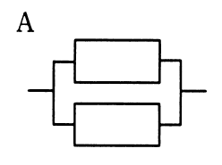
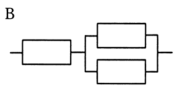
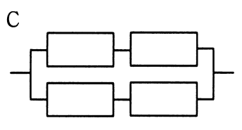

# 平成31年度春期 問13（コンピュータシステム）

## 問題文

稼働率が等しい装置を直列や並列に組み合わせたとき，システム全体の稼働率を高い順に並べたものはどれか。ここで，各装置の稼働率は0よりも大きく1未満である。

　　

ア　A，B，C

イ　A，C，B

ウ　C，A，B

エ　C，B，A

## 使用画像

## 解答と解説

**正解：イ**

各装置の稼働率をr（0＜r＜1）とし，3つの構成の稼働率を求める。

- **A**：2台を並列に接続した1組のみの構成。並列の稼働率は「1－（両方故障する確率）」＝1－(1－r)²
- **B**：1台を直列に接続した後，2台を並列に接続した組を直列に接続した構成。稼働率＝r×{1－(1－r)²}
- **C**：2台を並列に接続した組を2組直列に接続した構成。稼働率＝{1－(1－r)²}²

ここで，1－(1－r)²の値は0＜r＜1のとき0＜1－(1－r)²＜1であるため，これをkとおくと，A＝k，B＝r×k，C＝k²と表せる。r＜1，k＜1なので，r×k＜kかつk²＜kが成り立ち，AはBおよびCより必ず大きい。

次にBとCを比較すると，B＝r×k，C＝k×kであり，共通のkを除けばrとkの大小比較になる。k＝1－(1－r)²＝2r－r²＝r(2－r)であり，0＜r＜1の範囲では2－r＞1なので，k＞rとなる。したがって，C＝k×k＞k×r＝Bとなり，C＞Bが成り立つ。

以上より，稼働率の高い順はA，C，Bとなり，イが正解である。

**IPA公式：イ**

