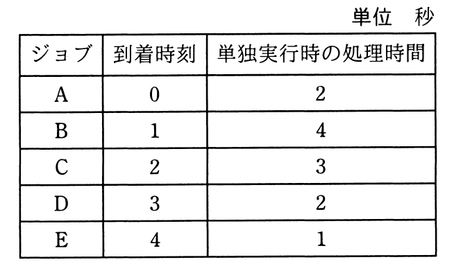

# 平成31年度春期 問16（コンピュータシステム）

## 問題文

五つのジョブA〜Eに対して，ジョブの多重度が1で，処理時間順方式のスケジューリングを適用した場合，ジョブBのターンアラウンドタイムは何秒か。ここで，OSのオーバヘッドは考慮しないものとする。

ア　8

イ　9

ウ　10

エ　11

## 使用画像

## 解答と解説

**正解：エ**

処理時間順方式（SJF：Shortest Job First，非プリエンプティブ）は，その時点で到着済み（実行待ち）のジョブの中から単独実行時の処理時間が最も短いものを選んで実行する方式である。多重度1（同時に1ジョブしか実行できない）という条件のもとでシミュレーションする。

- 時刻0：Aのみ到着 → Aを実行（処理時間2）。時刻0～2でA実行、時刻2に完了
- 時刻2：B(4)，C(3)が到着済み → 短い方のCを実行。時刻2～5でC実行，時刻5に完了
- 時刻5：B(4)，D(2)，E(1)が到着済み → 最短のEを実行。時刻5～6でE実行，時刻6に完了
- 時刻6：B(4)，D(2)が到着済み → 短い方のDを実行。時刻6～8でD実行，時刻8に完了
- 時刻8：残るBを実行。時刻8～12でB実行，時刻12に完了

ジョブBの到着時刻は1，完了時刻は12なので，ターンアラウンドタイム＝12－1＝11秒となる。よってエが正解である。

**IPA公式：エ**

