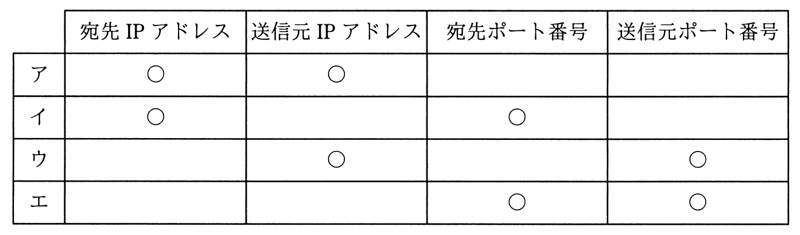

# 平成31年度春期 問31（技術要素）

## 問題文

プライベートIPアドレスを割り当てられたPCがNAPT（IPマスカレード）機能をもつルータを経由して，インターネット上のWebサーバにアクセスしている。WebサーバからPCへの応答パケットに含まれるヘッダ情報のうち，このルータで書き換えられるフィールドの組合せとして，適切なものはどれか。ここで，表中の○はフィールドの情報が書き換えられることを表す。

## 使用画像

## 解答と解説

**正解：イ**

NAPT（IPマスカレード）は、PCからインターネットへの往路では送信元IPアドレスと送信元ポート番号を（プライベート→グローバル、ポート番号も変換して）書き換える。復路（Webサーバからの応答パケット）では、その逆に**宛先IPアドレス**と**宛先ポート番号**を、グローバルIP・変換後ポートからプライベートIP・元のポートへと書き換えて、正しいPCへ届くようにする。したがって、応答パケットで書き換えられるのは宛先IPアドレスと宛先ポート番号の組合せであり、イが該当する。

- ア：往路（PC→サーバ）で書き換えられるフィールドの組合せ（送信元側）であり、復路には該当しない。
- ウ：宛先ポート番号ではなく送信元ポート番号を書き換えるとしている点が誤り。
- エ：宛先IPアドレスの書換えが抜けており、NAPTの動作と整合しない。

**IPA公式：イ**

