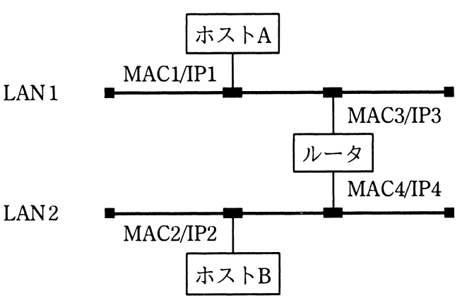
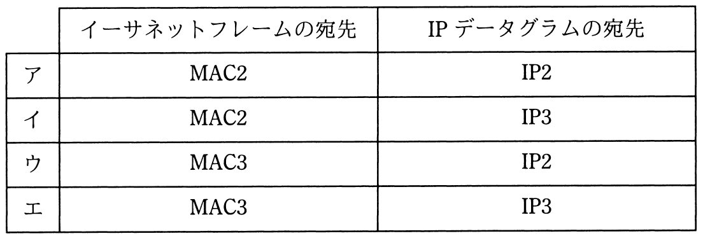

# 平成31年度春期 問33（技術要素）

## 問題文

図のようなIPネットワークのLAN環境で，ホストAからホストBにパケットを送信する。LAN1において，パケット内のイーサネットフレームの宛先とIPデータグラムの宛先の組合せとして，適切なものはどれか。ここで，図中のMACn/IPmはホスト又はルータがもつインタフェースのMACアドレスとIPアドレスを示す。

## 使用画像

## 解答と解説

**正解：ウ**

ホストAはLAN1上にあり、宛先のホストBはルータを越えたLAN2上にある。IPデータグラムの宛先アドレスは通信の最終目的地であるホストBのIPアドレス（IP2）のまま、経路上変化しない。一方、イーサネットフレームの宛先MACアドレスは同一LAN（ここではLAN1）内での次のホップ（次ホップ）を示すものであり、異なるLANへ転送する必要があるため、ホストAはLAN1上のルータのインタフェース（MAC3）宛にフレームを送信する。したがって、LAN1でのイーサネットフレームの宛先はMAC3、IPデータグラムの宛先はIP2となり、ウが正しい。

- ア・イ：フレーム宛先をMAC2（ホストB）としているが、ホストBはLAN1上に直接存在しないため誤り。
- エ：IPデータグラムの宛先をIP3（ルータのLAN1側インタフェース）としているが、IPの宛先は経路によらずホストBのIP2で変化しないため誤り。

**IPA公式：ウ**

