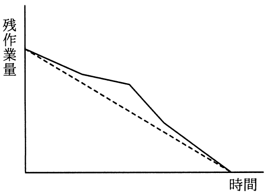
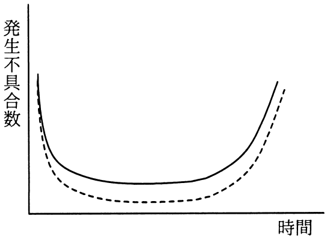
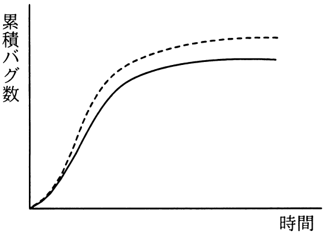
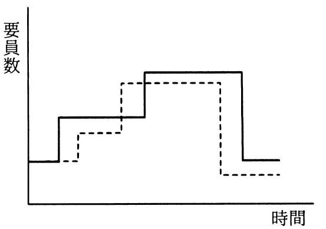

# 平成31年度春期 問49（開発技術）

## 問題文

アジャイル開発におけるプラクティスの一つであるバーンダウンチャートはどれか。ここで，図中の破線は予定又は予想を，実線は実績を表す。

ア　

イ　

ウ　

エ

## 使用画像

## 解答と解説

**正解：ア**

バーンダウンチャートは、アジャイル開発（スクラムなど）でイテレーション（スプリント）の進捗を管理するために用いるグラフで、縦軸に「残作業量」、横軸に「時間」を取り、時間の経過とともに残作業量が減少していく様子を表す。予定（破線）に対して実績（実線）がどのように推移しているかを可視化し、進捗の遅れ・進みを把握するために使う。

画像を確認すると、選択肢アの図は縦軸が「残作業量」、横軸が「時間」で、右肩下がりに0へ向かって減少する折れ線（破線が予定、実線が実績）となっており、まさにバーンダウンチャートの典型的な形である。したがって、アが正解である。

イ の図は縦軸が「発生不具合数」で時間経過とともにU字型（バスタブ曲線）を描いており、これは信頼性工学におけるバスタブ曲線（故障率曲線）の説明に近い。ウ の図は縦軸が「累積バグ数」でS字カーブを描いており、これはソフトウェア開発におけるバグ収束曲線（信頼度成長曲線）である。エ の図は縦軸が「要員数」で階段状に増減しており、要員計画（山積み・山崩し）を表すグラフであり、いずれもバーンダウンチャートではない。

**IPA公式：ア**

