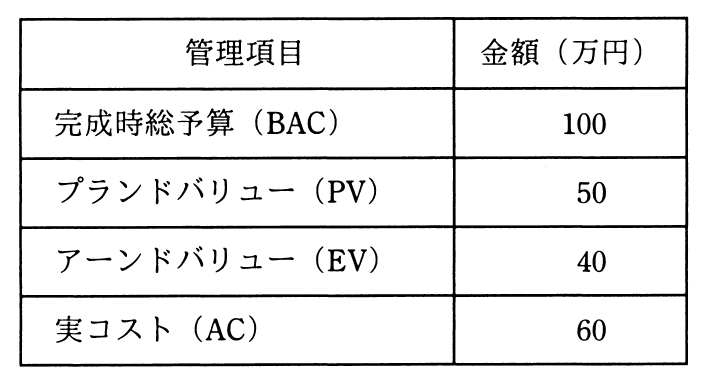

# 平成31年度春期 問52（マネジメント）

## 問題文

ある組織では，プロジェクトのスケジュールとコストの管理にアーンドバリューマネジメントを用いている。期間10日間のプロジェクトの，5日目の終了時点の状況は表のとおりである。この時点でのコスト効率が今後も続くとしたとき，完成時総コスト見積り（EAC）は何万円か。

ア　110

イ　120

ウ　135

エ　150

## 使用画像

## 解答と解説

**正解：エ**

アーンドバリューマネジメント（EVM）では、完成時総コスト見積り（EAC）は次の式で求める。

EAC = BAC ÷ CPI

ここで、CPI（コスト効率指数）= EV ÷ AC である。

表の値は、完成時総予算（BAC）= 100万円、プランドバリュー（PV）= 50万円、アーンドバリュー（EV）= 40万円、実コスト（AC）= 60万円である。

CPI = EV ÷ AC = 40 ÷ 60 = 2/3

EAC = BAC ÷ CPI = 100 ÷ (2/3) = 150万円

現時点のコスト効率（1コストあたりの出来高が計画より悪い状態）が今後も続くと仮定すると、完成時総コストは150万円になる。よってエが正解。

**IPA公式：エ**

