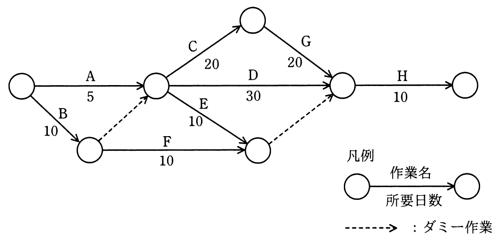

# 平成31年度春期 問53（マネジメント）

## 問題文

図のアローダイアグラムから読み取れることとして，適切なものはどれか。ここで，プロジェクトの開始日を1日目とする。

ア　作業Cを最も早く開始できるのは6日目である。

イ　作業Dはクリティカルパス上の作業である。

ウ　作業Eの総余裕時間は30日である。

エ　作業Fを最も遅く開始できるのは11日目である。

## 使用画像

## 解答と解説

**正解：ウ**

図のアローダイアグラムに従って各結合点の最早開始時刻・最遅開始時刻を計算する（開始日を1日目とする）。

- 開始点から作業A（5日）またはB（10日）を経て結合点①に至る。①への最早到達時間は、A経由=5、B経由（ダミー含む）=10なので、遅い方の10（＝作業11日目に開始可能）。
- ①から作業C（20日）を経て結合点②へ、①から作業D（30日）で結合点③へ、また結合点④はE（10日）・F（10日）経由で10（B経由）+10=20。
- 結合点③（Dの終点）への最早到達時間は、①(10)+D(30)=40、C+G経由は①(10)+C(20)+G(20)=50、E/F経由は10(④)+10(結合)=20。よって③の最早到達時間は50（C→Gルートが支配）。
- 全体の所要日数（最遅完了）は50+H(10)=60日。

これを基に各作業の最遅開始時刻を逆算すると、結合点③の最遅到達時刻は50（クリティカルパス上）。作業Eは結合点④（最早10・最遅は50-10=40相当の経路で余裕を持つ）に向かうため、Eの総余裕時間＝最遅完了(50) － 最早開始(10) － 所要日数(10) = 30日となる。

したがって「作業Eの総余裕時間は30日である」というウが正しい。

他の選択肢について：作業Cの最早開始は結合点①到達後（11日目）であり6日目ではない（ア誤り）。クリティカルパスはA→C→G→H（5+20+20+10+ダミー分＝合計60）であり、Dはクリティカルパス上ではない（イ誤り）。作業Fの最も遅い開始は結合点④の最遅到達時刻から逆算すると11日目ではない（エ誤り）。

**IPA公式：ウ**

