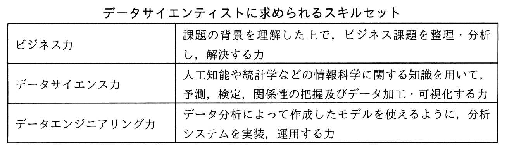

# 平成31年度春期 問63（ストラテジ）

## 問題文

ビッグデータを有効活用し，事業価値を生み出す役割を担う専門人材であるデータサイエンティストに求められるスキルセットを表の三つの領域と定義した。データサイエンス力に該当する具体的なスキルはどれか。

ア　扱うデータの規模や機密性を理解した上で，分析システムをオンプレミスで構築するか，クラウドサービスを利用して構築するかを判断し，設計できる。

イ　事業モデル，バリューチェーンなどの特徴や事業の主たる課題を自力で構造的に理解でき，問題の大枠を整理できる。

ウ　分散処理のフレームワークを用いて，計算処理を複数サーバに分散させる並列処理システムを設計できる。

エ　分析要件に応じ，決定木分析，ニューラルネットワークなどのモデリング手法の選択，モデルへのパラメタの設定，分析結果の評価ができる。

## 使用画像

