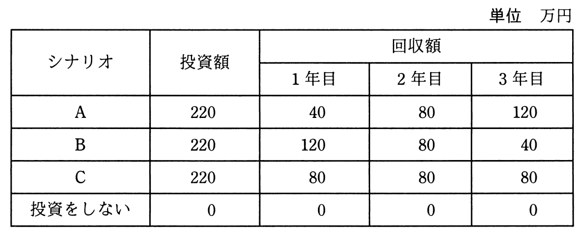

# 平成31年度春期 問64（ストラテジ）

## 問題文

投資効果を正味現在価値法で評価するとき，最も投資効果が大きい（又は損失が小さい）シナリオはどれか。ここで，期間は3年間，割引率は5％とし，各シナリオのキャッシュフローは表のとおりとする。

ア　A

イ　B

ウ　C

エ　投資をしない

## 使用画像

## 解答と解説

**正解：イ**

正味現在価値（NPV）は、各年のキャッシュフローを割引率で現在価値に割り引いた合計から投資額を差し引いて求める。割引率5％のときの現価係数は、1年目 約0.952、2年目 約0.907、3年目 約0.864である。

画像の表の回収額を用いて各シナリオの現在価値合計を計算すると、

- シナリオA（40, 80, 120）：40×0.952＋80×0.907＋120×0.864 ≒ 38.1＋72.6＋103.7＝214.3万円 → NPV＝214.3－220＝約－5.7万円
- シナリオB（120, 80, 40）：120×0.952＋80×0.907＋40×0.864 ≒ 114.3＋72.6＋34.6＝221.4万円 → NPV＝221.4－220＝約＋1.4万円
- シナリオC（80, 80, 80）：80×0.952＋80×0.907＋80×0.864 ≒ 76.2＋72.6＋69.1＝217.8万円 → NPV＝217.8－220＝約－2.2万円
- 投資をしない：NPV＝0万円

回収額が早期に大きいシナリオBほど割引の影響を受けにくく現在価値が高くなるため、B のNPVが唯一プラス（約＋1.4万円）となり、他の投資シナリオ（A、C）はマイナス、かつ投資をしない場合（0万円）よりも大きい。したがって、投資効果が最も大きいのはシナリオBであり、イが正解である。

**IPA公式：イ**
