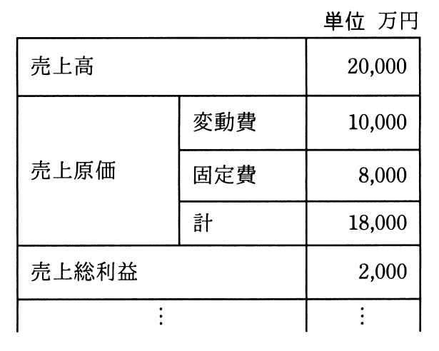

# 平成31年度春期 問76（ストラテジ）

## 問題文

表の事業計画案に対して，新規設備投資に伴う減価償却費（固定費）の増加1,000万円を織り込み，かつ，売上総利益を3,000万円とするようにしたい。変動費率に変化がないとすると，売上高の増加を何万円にすればよいか。

ア　2,000

イ　3,000

ウ　4,000

エ　5,000

## 使用画像

## 解答と解説

**正解：ウ**

画像の事業計画案（単位：万円）は次のとおり。

- 売上高：20,000
- 変動費：10,000（変動費率 = 10,000 ÷ 20,000 = 50%）
- 固定費：8,000
- 売上原価計：18,000
- 売上総利益：2,000

新規設備投資により固定費が1,000万円増加するため、新たな固定費は 8,000 + 1,000 = 9,000万円となる。変動費率50%は変わらないとして、売上高の増加分をΔとすると、新しい売上高は 20,000 + Δ となる。

売上総利益 = 売上高 − 変動費 − 固定費
3,000 = (20,000 + Δ) − 0.5×(20,000 + Δ) − 9,000
3,000 = 0.5×(20,000 + Δ) − 9,000
12,000 = 0.5×(20,000 + Δ)
24,000 = 20,000 + Δ
Δ = 4,000

したがって、売上高の増加は4,000万円必要であり、正解はウとなる。

**IPA公式：ウ**
