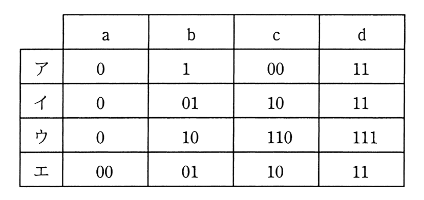

# 令和2年度秋期 問4（基礎理論）

## 問題文

a，b，c，dの4文字から成るメッセージを符号化してビット列にする方法として表のア〜エの4通りを考えた。この表はa，b，c，dの各1文字を符号化するときのビット列を表している。メッセージ中でのa，b，c，dの出現頻度は，それぞれ50％，30％，10％，10％であることが分かっている。符号化されたビット列から元のメッセージが一意に復号可能であって，ビット列の長さが最も短くなるものはどれか。

## 使用画像

