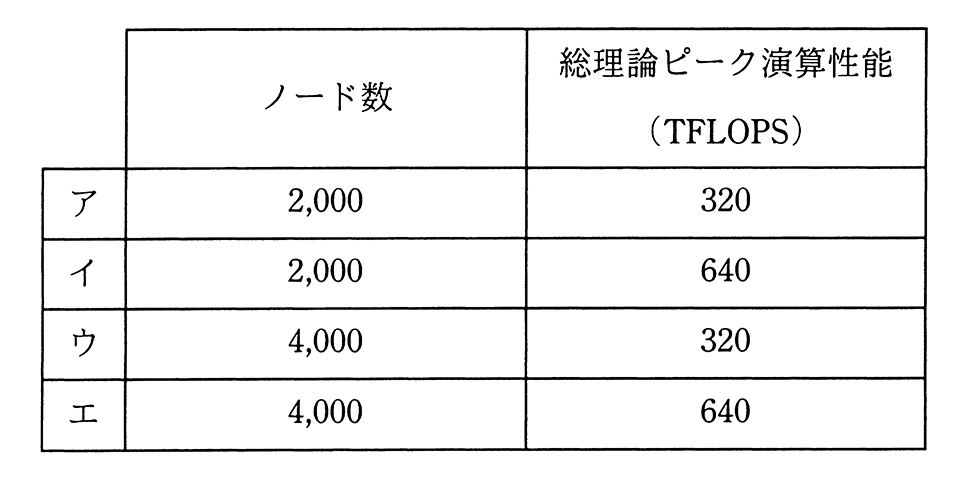

# 令和2年度秋期 問12（コンピュータシステム）

## 問題文

現状のHPC（High Performance Computing）マシンの構成を，次の条件で更新することにした。更新後の，ノード数と総理論ピーク演算性能はどれか。ここで，総理論ピーク演算性能は，コア数に比例するものとする。

〔現状の構成〕

（1）一つのコアの理論ピーク演算性能は10GFLOPSである。

（2）一つのノードのコア数は8である。

（3）ノード数は1,000である。

〔更新条件〕

（1）一つのコアの理論ピーク演算性能を現状の2倍にする。

（2）一つのノードのコア数を現状の2倍にする。

（3）総コア数を現状の4倍にする。

## 使用画像

