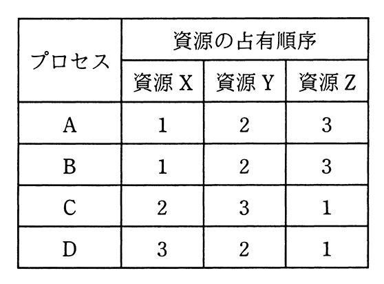

# 令和2年度秋期 問17（コンピュータシステム）

## 問題文

三つの資源X〜Zを占有して処理を行う四つのプロセスA〜Dがある。各プロセスは処理の進行に伴い，表中の数値の順に資源を占有し，実行終了時に三つの資源を一括して解放する。プロセスAと同時にもう一つプロセスを動かした場合に，デッドロックを起こす可能性があるプロセスはどれか。

ア　B，C，D

イ　C，D

ウ　Cだけ

エ　Dだけ

## 使用画像

