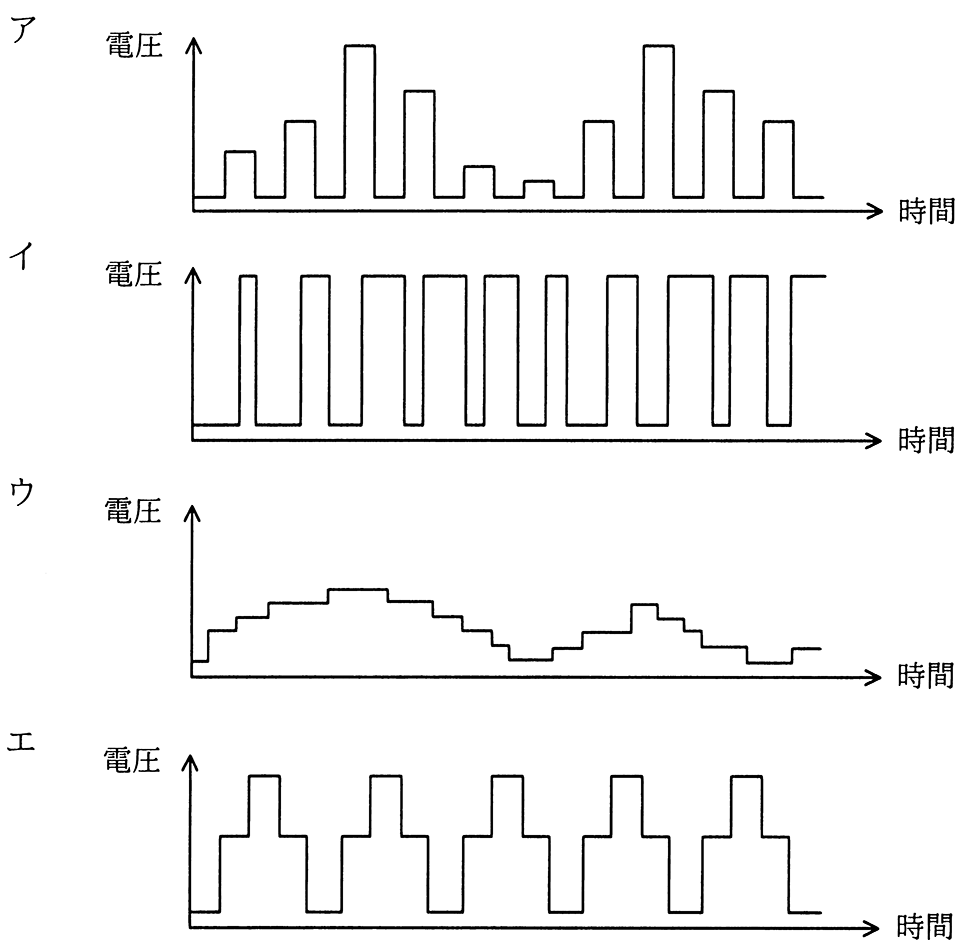

# 令和2年度秋期 問22（コンピュータシステム）

## 問題文

モータの速度制御などにPWM（Pulse Width Modulation）制御が用いられる。PWMの駆動波形を示したものはどれか。ここで，波形は制御回路のポート出力であり，低域通過フィルタを通していないものとする。

## 使用画像

## 解答と解説

**正解：イ**

PWM（Pulse Width Modulation：パルス幅変調）は，一定周期の矩形波（ON/OFFを繰り返す信号）において，パルスの幅（デューティ比）を変化させることで平均電圧＝実効的な出力を制御する方式である。低域通過フィルタを通す前のポート出力波形は，振幅が一定でパルス幅だけが変化する矩形波列となる。

画像の波形イは，振幅（電圧の高さ）は常に一定で，High区間の幅（デューティ比）だけが変化している矩形波であり，これがPWM駆動波形の特徴と一致する。

- ア　振幅（電圧の高さ）自体が段階的に変化しており，PAM（パルス振幅変調）的な波形であるためPWMではない。
- ウ　滑らかに変化する階段状の波形で，フィルタ後のアナログ的な波形に近く，フィルタを通していないPWM出力とは異なる。
- エ　パルス幅は一定で周期的に電圧レベルが変化しており，PWMの「幅の変調」という特徴に合致しない。

**IPA公式：イ**

