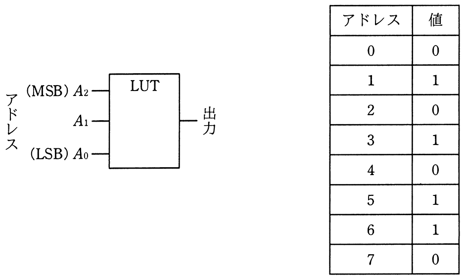
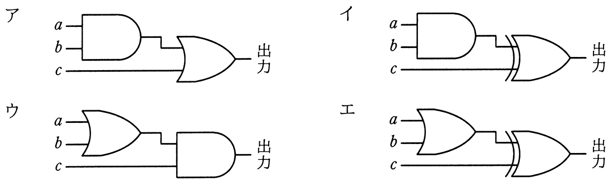

# 令和2年度秋期 問23（コンピュータシステム）

## 問題文

次の表に示す値が格納されたLUT（Lookup Table）と等価な回路はどれか。ここで，LUTのアドレス信号A_2〜A_0はA_0がLSBで，ア〜エの回路の入力信号aがA_2，bがA_1，cがA_0に対応する。

## 使用画像

## 解答と解説

**正解：イ**

LUTのアドレス（A2A1A0＝abc）と値の対応は次のとおりである。

| a b c | 出力 |
|---|---|
| 0 0 0 | 0 |
| 0 0 1 | 1 |
| 0 1 0 | 0 |
| 0 1 1 | 1 |
| 1 0 0 | 0 |
| 1 0 1 | 1 |
| 1 1 0 | 1 |
| 1 1 1 | 0 |

この真理値表は「(a AND b) XOR c」で表される。実際に各組合せで検証すると，a=1,b=1のときのみAND(a,b)=1となり，c=0で出力1，c=1で出力0（XORで反転）となる一方，a・bのいずれかが0のときはAND=0なのでXORの結果はcの値そのものになる。これは表の値と完全に一致する。

回路イは，aとbをANDゲートに入力し，その出力とcをXORゲート（二重線の記号）に入力する構成であり，「(a AND b) XOR c」を実現している。

- ア　AND出力とcをORゲートで結合する構成であり，(a AND b) OR cとなるため，例えばa=b=0,c=1のとき出力1は一致するが，a=1,b=1,c=1のとき出力1となり，表の0と食い違う。
- ウ・エ　OR（a,b）を先に取る構成のため，a=0,b=0,c=1のときOR=0からの展開で表の値と一致しない組合せが生じる。

**IPA公式：イ**

