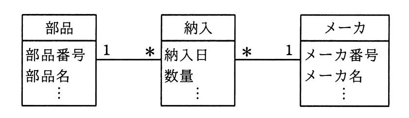

# 令和2年度秋期 問27（技術要素）

## 問題文

UMLを用いて表した図のデータモデルから，“部品”表，“納入”表及び“メーカ”表を関係データベース上に定義するときの解釈のうち，適切なものはどれか。

ア　同一の部品を同一のメーカから複数回納入することは許されない。

イ　“納入”表に外部キーは必要ない。

ウ　部品番号とメーカ番号の組みを“納入”表の候補キーの一部にできる。

エ　“メーカ”表は，外部キーとして部品番号をもつことになる。

## 使用画像

## 解答と解説

**正解：ウ**

UML図では，“部品”1対“納入”多，“納入”多対1“メーカ”という多重度が示されている。つまり，1つの部品は複数の納入に対応し，1つのメーカも複数の納入に対応する多対多の関係が，連関エンティティ“納入”によって解消されている構造である。

このような多対多を解消する連関表では，両側の親テーブルの主キー（部品番号，メーカ番号）を外部キーとして持ち，通常その組合せが（他の属性と合わせて）候補キーの一部となる。したがって，「部品番号とメーカ番号の組みを“納入”表の候補キーの一部にできる」というウは適切である。

- ア　多重度上は，同一部品を同一メーカから複数回（別納入日）納入することを妨げる制約はなく，むしろ“納入日”が存在することからも複数回の納入が想定されている。
- イ　“納入”表は部品・メーカの両方に関連するエンティティであるため，双方の主キーを外部キーとして持つ必要がある。
- エ　外部キーとして部品番号を持つのは“メーカ”表ではなく“納入”表である。“メーカ”表が部品番号を外部キーに持つことはない。

**IPA公式：ウ**

