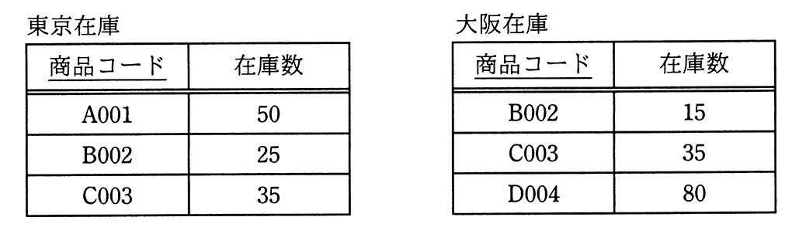
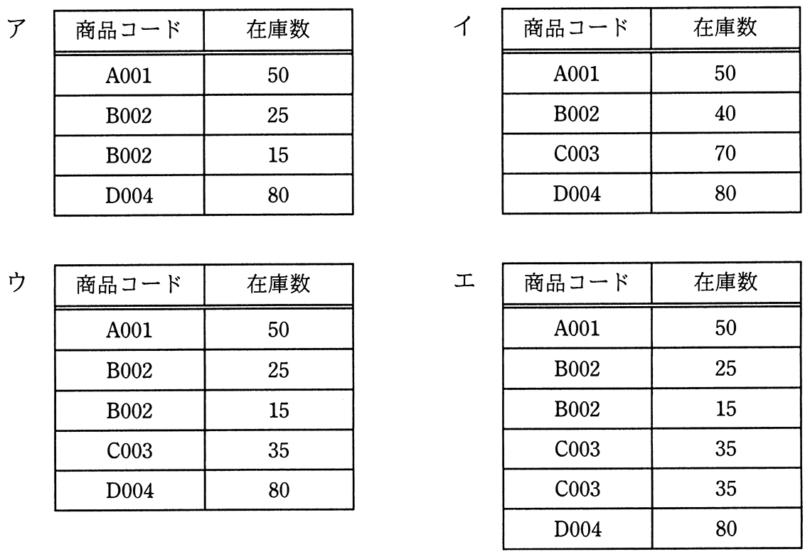

# 令和2年度秋期 問29（技術要素）

## 問題文

“東京在庫”表と“大阪在庫”表に対して，SQL文を実行して得られる結果はどれか。ここで，実線の下線は主キーを表す。

〔SQL文〕

SELECT 商品コード, 在庫数 FROM 東京在庫

　　　　UNION ALL

SELECT 商品コード, 在庫数 FROM 大阪在庫

## 使用画像

## 解答と解説

**正解：エ**

UNION ALLは、2つのSELECT結果を重複除去や集計を行わずに単純に連結する集合演算である。

東京在庫（A001=50, B002=25, C003=35の3行）と大阪在庫（B002=15, C003=35, D004=80の3行）をUNION ALLで連結すると、重複行があってもそのまま残されるため、結果は必ず6行になる：

- A001, 50
- B002, 25
- C003, 35
- B002, 15
- C003, 35
- D004, 80

商品コードが重複していても集約されず、両表の行がそのまま積み重なる点がUNION ALLの特徴である（重複を除去する通常のUNIONや、GROUP BYによる集計とは異なる）。この6行の結果と一致するのが選択肢エである。

他の選択肢のうち、B002やC003の在庫数が合算（例: B002＝40, C003＝70）されている場合、それはSUM関数とGROUP BYを用いた集計結果であり、単純な連結であるUNION ALLの結果としては誤りである。

**IPA公式：エ**

