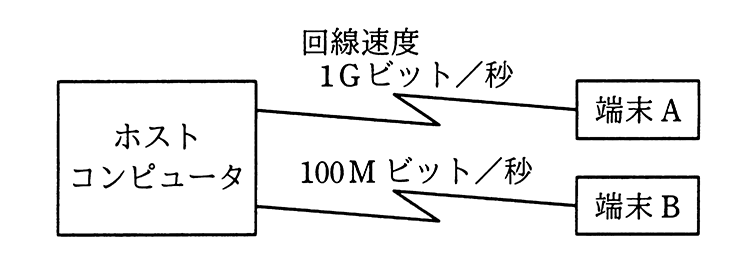

# 令和2年度秋期 問32（技術要素）

## 問題文

図のようなネットワーク構成のシステムにおいて，同じメッセージ長のデータをホストコンピュータとの間で送受信した場合のターンアラウンドタイムは，端末Aでは100ミリ秒，端末Bでは820ミリ秒であった。上り，下りのメッセージ長は同じ長さで，ホストコンピュータでの処理時間は端末A，端末Bのどちらから利用しても同じとするとき，端末Aからホストコンピュータへの片道の伝送時間は何ミリ秒か。ここで，ターンアラウンドタイムは，端末がデータを回線に送信し始めてから応答データを受信し終わるまでの時間とし，伝送時間は回線速度だけに依存するものとする。

ア　10

イ　20

ウ　30

エ　40

## 使用画像

## 解答と解説

**正解：エ**

端末Aの回線速度は1Gビット／秒，端末Bの回線速度は100Mビット／秒である。メッセージ長をLビット，ホストでの処理時間をTミリ秒とすると，ターンアラウンドタイムは「往復の伝送時間＋処理時間」なので，次の連立方程式が立てられる（伝送時間は上り下りとも同じ長さなので2倍する）。

- 端末A：2×(L / 1,000M) + T = 100
- 端末B：2×(L / 100M) + T = 820

2式の差を取ると，Tが消去できる。

2L×(1/100M − 1/1,000M) = 720
2L×(10/1,000M − 1/1,000M) = 720
2L×9/1,000M = 720
L = 720×1,000M / 18 = 40,000,000ビット

端末Aの片道の伝送時間は，L / 1,000M = 40,000,000 / 1,000,000,000 = 0.04秒 = 40ミリ秒

よって答えはエの40ミリ秒である（このときT = 100 − 2×40 = 20ミリ秒となり，端末B側でも2×400+20=820ミリ秒と整合する）。

**IPA公式：エ**

