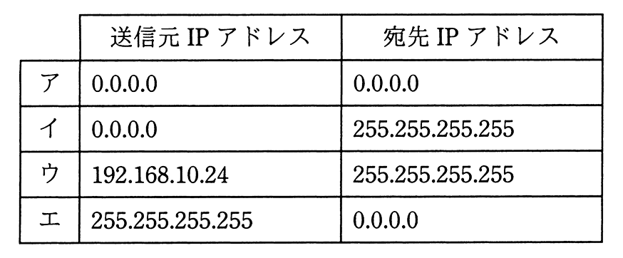

# 令和2年度秋期 問35（技術要素）

## 問題文

IPv4ネットワークにおいて，IPアドレスを付与されていないPCがDHCPサーバを利用してネットワーク設定を行う際，最初にDHCPDISCOVERメッセージをブロードキャストする。このメッセージの送信元IPアドレスと宛先IPアドレスの適切な組合せはどれか。ここで，このPCにはDHCPサーバからIPアドレス192.168.10.24が付与されるものとする。

## 使用画像

