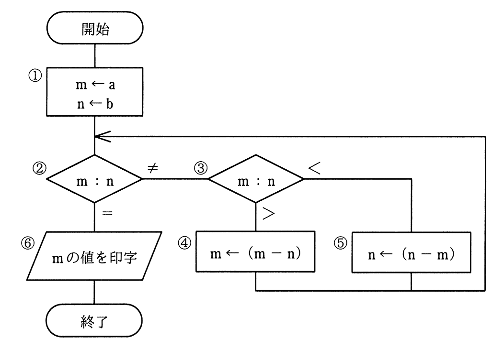

# 令和2年度秋期 問47（基礎理論）

## 問題文

次の流れ図において，

　　　　① → ② → ③ → ⑤ → ② → ③ → ④ → ② → ⑥

の順に実行させるために，①においてmとnに与えるべき初期値aとbの関係はどれか。ここで，a，bはともに正の整数とする。

ア　a＝2b

イ　2a＝b

ウ　2a＝3b

エ　3a＝2b

## 使用画像

## 解答と解説

**正解：エ**

流れ図はユークリッドの互除法で最大公約数を求める処理である。①でm←a、n←bとし、②でm＝nなら⑥へ、m≠nなら③でm＞nかどうかを判定し、m＞nなら④でm←m−n、m＜nなら⑤でn←n−mとして②に戻る、という流れになっている。

要求される実行順序「①→②→③→⑤→②→③→④→②→⑥」をたどるには、1回目の③判定でm＜n（⑤を実行）、2回目の③判定でm＞n（④を実行）となり、その後m＝nとなって⑥に到達する必要がある。

各選択肢についてb＝1（または適当な比）とおいてトレースすると、エの3a＝2b（例：a＝2, b＝3）の場合のみ、m=2,n=3から始めて「②m≠n→③m<n→⑤n←1→②m≠n→③m>n→④m←1→②m=n→⑥」という経路をたどり、要求された実行順序と一致する。他の選択肢（ア、イ、ウ）はいずれもこの順序と異なる経路（③④が先に実行される、または途中の分岐回数が異なる）になる。

**IPA公式：エ**

