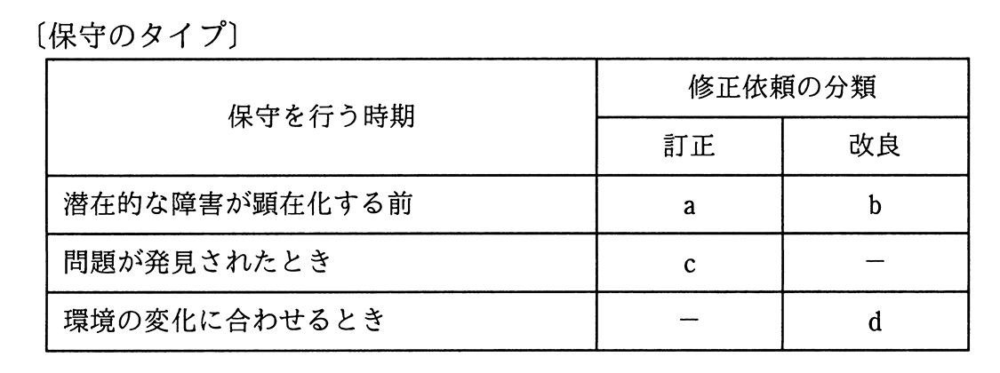
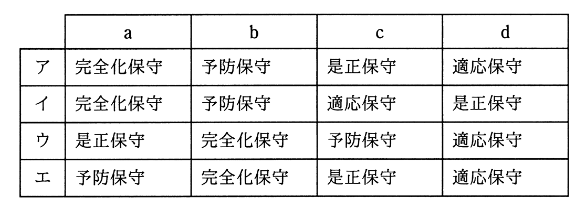

# 令和2年度秋期 問48（開発技術）

## 問題文

ソフトウェア保守で修正依頼を保守のタイプに分けるとき，次のa〜dに該当する保守のタイプの，適切な組合せはどれか。

## 使用画像

## 解答と解説

**正解：エ**

ソフトウェア保守は、保守を行う時期と修正依頼の分類（訂正／改良）によって次のように分類される。

- a：潜在的な障害が顕在化する前に「訂正」を行う → 予防保守（障害が発生する前に予防的に修正する）
- b：潜在的な障害が顕在化する前に「改良」を行う → 完全化保守（性能や保守性などを向上させる改良）
- c：問題が発見されたときに「訂正」を行う → 是正保守（実際に発生した不具合を修正する）
- d：環境の変化に合わせて「改良」を行う → 適応保守（OSやハードウェアなど稼働環境の変化に対応する）

この組合せに一致するのはエ（予防保守，完全化保守，是正保守，適応保守）である。他の選択肢は用語の対応関係が入れ替わっており、bとcの関係、あるいはaとbの関係が正しくない。

**IPA公式：エ**

