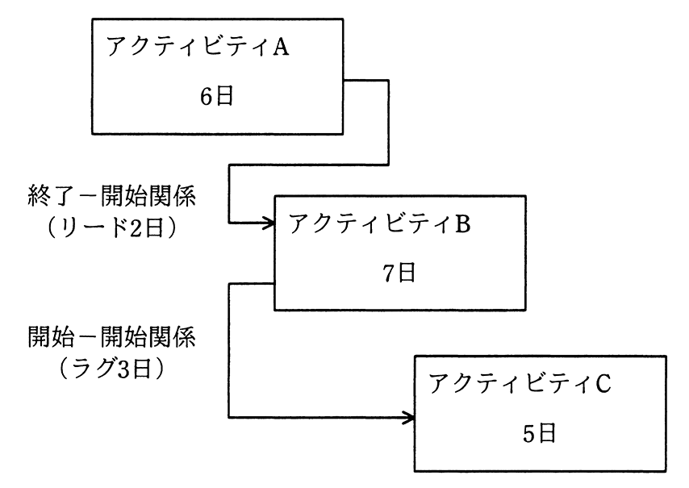

# 令和2年度秋期 問53（マネジメント）

## 問題文

図は，実施する三つのアクティビティについて，プレシデンスダイアグラム法を用いて，依存関係及び必要な作業日数を示したものである。全ての作業を完了するのに必要な日数は最少で何日か。

ア　11

イ　12

ウ　13

エ　14

## 使用画像

## 解答と解説

**正解：イ**

図より、アクティビティAは所要日数6日。AとBは終了－開始関係でリード2日（Bの開始をAの終了より2日前倒しできる）なので、Bの開始日はA終了（6日目）の2日前、すなわち4日目に開始でき、Bの所要日数7日を加えるとBの終了は4＋7＝11日目となる。

BとCは開始－開始関係でラグ3日（Cの開始はBの開始より3日遅れる）なので、Cの開始日はBの開始（4日目）から3日後の7日目となり、Cの所要日数5日を加えるとCの終了は7＋5＝12日目となる。

全ての作業が完了するのは、BとCそれぞれの終了日のうち遅い方であり、B終了11日目、C終了12日目なので、最少の所要日数は12日である。

**IPA公式：イ**

