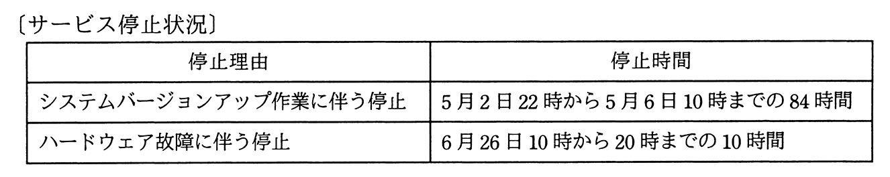

# 令和2年度秋期 問56（マネジメント）

## 問題文

サービス提供時間帯が毎日0〜24時のITサービスにおいて，ある年の4月1日0時から6月30日24時までのサービス停止状況は表のとおりであった。システムバージョンアップ作業に伴う停止時間は，計画停止時間として顧客との間で合意されている。このとき，4月1日から6月30日までのITサービスの可用性は何％か。ここで，可用性（％）は小数第3位を四捨五入するものとする。

ア　95.52

イ　95.70

ウ　99.52

エ　99.63

## 使用画像

## 解答と解説

**正解：ウ**

4月1日0時から6月30日24時までの総時間は、4月（30日）＋5月（31日）＋6月（30日）＝91日であり、91日×24時間＝2,184時間である。

サービス停止のうち、システムバージョンアップ作業に伴う84時間の停止は「計画停止時間」として顧客と合意されているため、可用性の算定対象となる稼働時間（サービス提供時間）から除外する。したがって、可用性算定の母数となる時間は、2,184時間－84時間＝2,100時間となる。

一方、ハードウェア故障に伴う10時間の停止は計画外の停止（サービス停止時間）としてそのままカウントする。

可用性（％）＝（サービス提供時間－サービス停止時間）／サービス提供時間×100
＝（2,100－10）／2,100×100
＝2,090／2,100×100
＝99.523…％

小数第3位を四捨五入すると99.52％となる。

**IPA公式：ウ**

