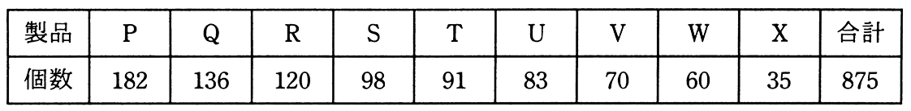

# 令和2年度秋期 問74（ストラテジ）

## 問題文

不良品の個数を製品別に集計すると表のようになった。ABC分析を行って，まずA群の製品に対策を講じることにした。A群の製品は何種類か。ここで，A群は70％以上とする。

ア　3

イ　4

ウ　5

エ　6

## 使用画像

## 解答と解説

**正解：ウ**

ABC分析では、対象を数値の大きい順に並べ、その累積構成比によってA群（重点管理対象、目安として累積70%程度まで）・B群・C群に分類する。

表のデータを個数の多い順に並べ、累積比率（合計875個に対する割合）を計算する。

| 製品 | 個数 | 累計個数 | 累積比率 |
|---|---|---|---|
| P | 182 | 182 | 20.8% |
| Q | 136 | 318 | 36.3% |
| R | 120 | 438 | 50.1% |
| S | 98 | 536 | 61.3% |
| T | 91 | 627 | 71.7% |
| U | 83 | 710 | 81.1% |

累積比率が70%を初めて超えるのはP・Q・R・S・Tの5製品目（71.7%）である。したがって、70%以上を占めるA群は5種類となる。

**IPA公式：ウ**

