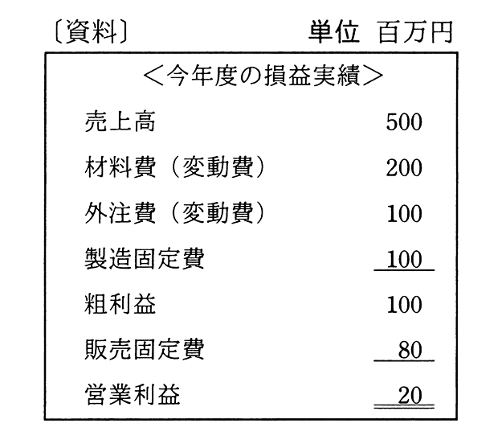

# 令和2年度秋期 問77（ストラテジ）

## 問題文

資料は今年度の損益実績である。翌年度の計画では，営業利益を30百万円にしたい。翌年度の売上高は何百万円を計画すべきか。ここで，翌年度の固定費，変動費率は今年度と変わらないものとする。

ア　510

イ　525

ウ　550

エ　575

## 使用画像

## 解答と解説

**正解：イ**

資料より、今年度の実績は次のとおりである。

- 売上高：500百万円
- 変動費：材料費200＋外注費100＝300百万円
- 固定費：製造固定費100＋販売固定費80＝180百万円

変動費率＝変動費÷売上高＝300÷500＝0.6（60%）

翌年度も変動費率・固定費は変わらないものとして、目標営業利益30百万円を達成するために必要な売上高をSとすると、

営業利益＝売上高－変動費－固定費
30 = S － 0.6S － 180
30 = 0.4S － 180
0.4S = 210
S = 525（百万円）

したがって、翌年度の売上高は525百万円を計画すべきである。

**IPA公式：イ**

