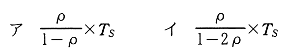
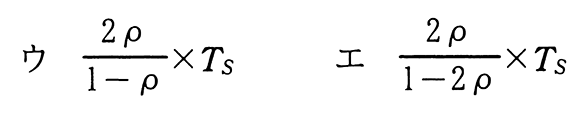

# 令和3年度秋期 問2（基礎理論）

## 問題文

ATM（現金自動預払機）が1台ずつ設置してある二つの支店を統合し，統合後の支店にはATMを1台設置する。統合後のATMの平均待ち時間を求める式はどれか。ここで，待ち時間はM/M/1の待ち行列モデルに従い，平均待ち時間にはサービス時間を含まず，ATMを1台に統合しても十分に処理できるものとする。

〔条件〕

（1）統合後の平均サービス時間：Ts

（2）統合前のATMの利用率：両支店ともρ

（3）統合後の利用者数：統合前の両支店の利用者数の合計

## 使用画像

