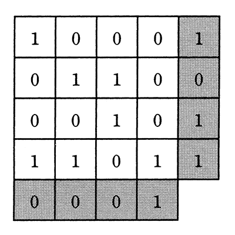

# 令和3年度秋期 問4（基礎理論）

## 問題文

図のように16ビットのデータを4×4の正方形状に並べ，行と列にパリティビットを付加することによって何ビットまでの誤りを訂正できるか。ここで，図の網掛け部分はパリティビットを表す。

ア　1

イ　2

ウ　3

エ　4

## 使用画像

## 解答と解説

**正解：ア**

図は4×4のデータビットに対して、各行の末尾（右端列）と各列の末尾（下端行）にパリティビット（網掛け部分）を付加した水平垂直パリティ（2次元パリティ）方式を示している。

この方式では、1ビットの誤りが発生すると、その誤りが含まれる行のパリティと列のパリティの両方に矛盾が生じる。矛盾したパリティの行と列の交点を特定すれば、誤りが発生したビットの位置を一意に特定でき、そのビットを反転させることで訂正できる。したがって、この方式で訂正できるのは1ビットまでである。

2ビット以上の誤りが同時に発生すると、誤りビットの位置によっては行・列のパリティが同じ場所を指し示さず、あるいは誤りが相殺されてパリティ上は矛盾が現れないケースも生じるため、正しく訂正できない。よって正解は1ビット（ア）である。

**IPA公式：ア**

