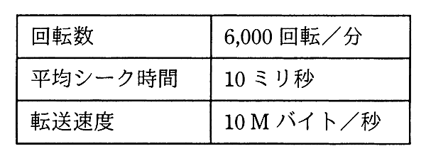

# 令和3年度秋期 問11（コンピュータシステム）

## 問題文

表に示す仕様の磁気ディスク装置において，1,000バイトのデータの読取りに要する平均時間は何ミリ秒か。ここで，コントローラの処理時間は平均シーク時間に含まれるものとする。

ア　15.1

イ　16.0

ウ　20.1

エ　21.0

## 使用画像

## 解答と解説

**正解：ア**

画像の仕様は、回転数6,000回転／分、平均シーク時間10ミリ秒、転送速度10Mバイト／秒である。

1,000バイトのデータ読取りに要する平均時間は、次の3つの要素の合計となる。

1. 平均シーク時間：10ミリ秒（問題文の条件によりコントローラの処理時間を含む）
2. 平均回転待ち時間：ディスクが1回転する時間の半分。1回転にかかる時間は60秒／6,000回転＝0.01秒＝10ミリ秒であり、平均回転待ち時間はその半分の5ミリ秒
3. データ転送時間：1,000バイト／10Mバイト毎秒＝1,000／10,000,000秒＝0.0001秒＝0.1ミリ秒

これらを合計すると、10＋5＋0.1＝15.1ミリ秒となり、選択肢アと一致する。

**IPA公式：ア**

