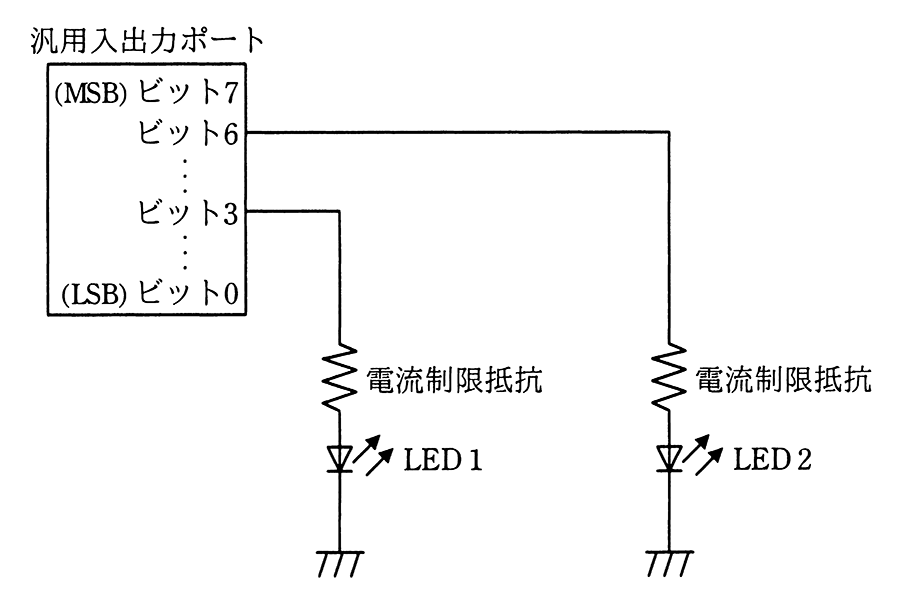

# 令和3年度秋期 問23（コンピュータシステム）

## 問題文

マイコンの汎用入出力ポートに接続されたLED1を，LED2の状態を変化させずに点灯したい。汎用入出力ポートに書き込む値として，適切なものはどれか。ここで，使用されている汎用入出力ポートのビットは全て出力モードに設定されていて，出力値の読出しが可能で，この操作の間に汎用入出力ポートに対する他の操作は行われないものとする。

ア　汎用入出力ポートから読み出した値と16進数の08との論理積

イ　汎用入出力ポートから読み出した値と16進数の08との論理和

ウ　汎用入出力ポートから読み出した値と16進数の48との論理積

エ　汎用入出力ポートから読み出した値と16進数の48との論理和

## 使用画像

## 解答と解説

**正解：イ**

画像より，LED1はビット3，LED2はビット6に接続されている。ビット3のみを1にして点灯させ，かつLED2（ビット6）を含む他のビットの状態を変化させないためには，読み出した現在値に対してビット3だけを1にする操作を行えばよい。

16進数08は2進数で「0000 1000」であり，ビット3のみが1のビットパターンである。読み出した値とこのビットパターンとの論理和（OR）を取ると，ビット3は強制的に1（点灯）になり，それ以外のビット（ビット6を含む）は元の値がそのまま保持される。これにより，LED2の状態を変えずにLED1だけを点灯できる。

アは論理積（AND）であり，ビット3以外のビットがすべて0にクリアされてしまうため，LED2の状態を保持できない。ウ・エは16進数48（0100 1000）を用いており，ビット6（LED2に対応）にも影響を与えてしまうため不適切である。

**IPA公式：イ**

