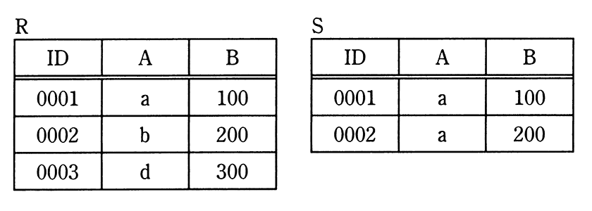
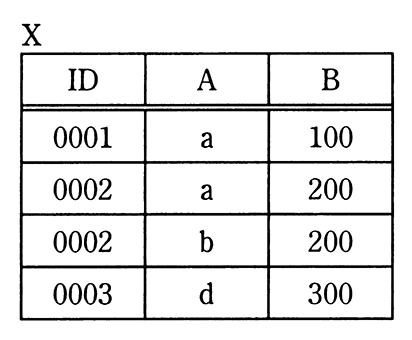

# 令和3年度秋期 問26（技術要素）

## 問題文

関係Rと関係Sに対して，関係Xを求める関係演算はどれか。

ア　IDで結合

イ　差

ウ　直積

エ　和

## 使用画像

## 解答と解説

**正解：エ**

画像より，関係Rは（ID, A, B）=（0001,a,100），（0002,b,200），（0003,d,300）の3行，関係Sは（0001,a,100），（0002,a,200）の2行である。関係Xは，Rの3行に加えてSの（0002,a,200）を含む合計4行（0001,a,100 / 0002,a,200 / 0002,b,200 / 0003,d,300）から成る。

これはRとSの行を単純に重ね合わせ，同一の行（0001,a,100）は1行にまとめた結果であり，関係代数における「和（UNION）」の定義そのものである。和演算は，同じ属性構成を持つ2つの関係の行を重複を除いて合成する演算であり，Xの内容と完全に一致する。

アの結合はIDをキーに列を横に連結する演算でありXのような行構成にはならない。イの差はRにあってSにない行のみを抽出する演算，ウの直積は両関係の行同士を総当たりで組み合わせる演算であり，いずれもXの行数・内容と一致しない。

**IPA公式：エ**

