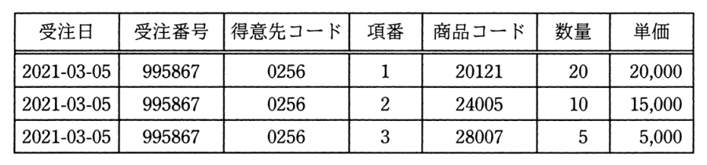

# 令和3年度秋期 問28（技術要素）

## 問題文

受注入力システムによって作成される次の表に関する記述のうち，適切なものはどれか。受注番号は受注ごとに新たに発行される番号であり，項番は1回の受注で商品コード別に連番で発行される番号である。

　なお，単価は商品コードによって一意に定まる。

ア　第1正規形でない。

イ　第1正規形であるが第2正規形でない。

ウ　第2正規形であるが第3正規形でない。

エ　第3正規形である。

## 使用画像

## 解答と解説

**正解：イ**

この表の主キーは（受注番号, 項番）の組み合わせである。各列がこの主キーにどう従属しているかを確認すると，受注日・得意先コードは受注番号のみで一意に定まり（項番によらない），主キーの一部（受注番号）にしか従属していない部分関数従属となっている。これは第2正規形の条件（非キー属性が主キー全体に完全関数従属していること）に違反する。

一方，繰り返し項目がなく，各属性はスカラ値（単一値）で構成されているため，第1正規形の条件は満たしている。したがって，この表は「第1正規形であるが第2正規形でない」状態にある。

なお，単価は商品コードによって一意に定まるとされており，商品コードは非キー属性であるため，単価は主キーに対して推移的関数従属の関係にもなっている。これは第3正規形の条件にも違反する内容だが，そもそも第2正規形を満たしていない時点でウ・エは誤りとなる。アは繰返し項目がないため誤り。

**IPA公式：イ**

