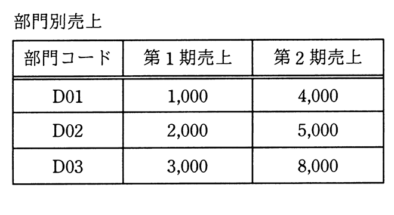
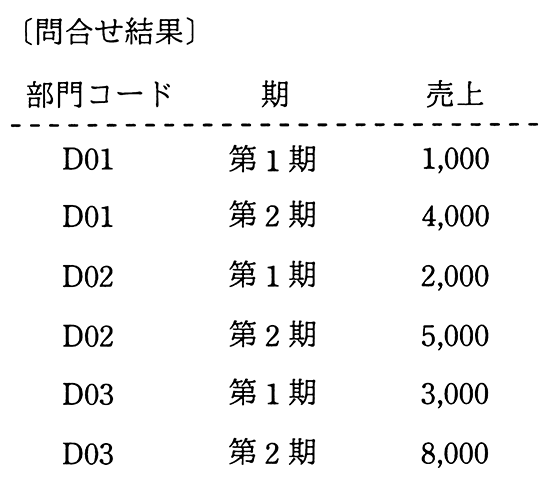

# 令和3年度秋期 問29（技術要素）

## 問題文

“部門別売上”表から，部門コードごと，期ごとの売上を得るSQL文はどれか。

ア　SELECT 部門コード, '第1期' AS 期, 第1期売上 AS 売上

　　  FROM 部門別売上

　　  INTERSECT

　　  (SELECT 部門コード, '第2期' AS 期, 第2期売上 AS 売上

　　    FROM 部門別売上)

　　  ORDER BY 部門コード, 期

イ　SELECT 部門コード, '第1期' AS 期, 第1期売上 AS 売上

　　  FROM 部門別売上

　　  UNION

　　  (SELECT 部門コード, '第2期' AS 期, 第2期売上 AS 売上

　　    FROM 部門別売上)

　　  ORDER BY 部門コード, 期

ウ　SELECT A.部門コード, '第1期' AS 期, A.第1期売上 AS 売上

　　  FROM 部門別売上 A

　　  CROSS JOIN

　　  (SELECT B.部門コード, '第2期' AS 期, B.第2期売上 AS 売上

　　       FROM 部門別売上 B) T

　　  ORDER BY 部門コード, 期

エ　SELECT A.部門コード, '第1期' AS 期, A.第1期売上 AS 売上

　　  FROM 部門別売上 A

　　  INNER JOIN

　　  (SELECT B.部門コード, '第2期' AS 期, B.第2期売上 AS 売上

　　       FROM 部門別売上 B) T ON A.部門コード = T.部門コード

　　  ORDER BY 部門コード, 期

## 使用画像

