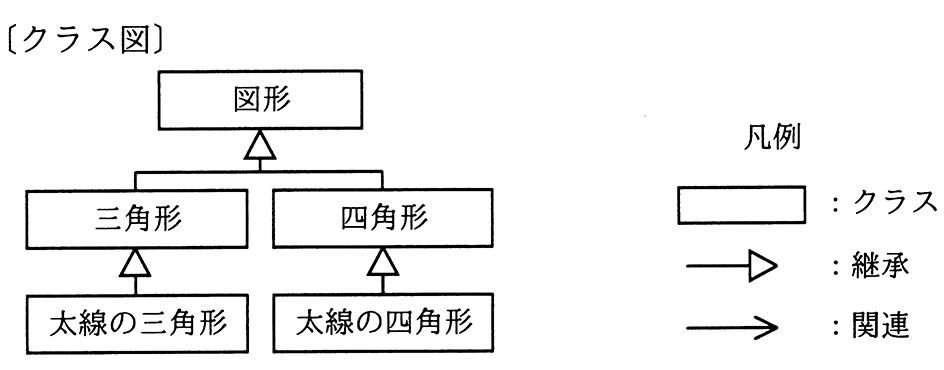
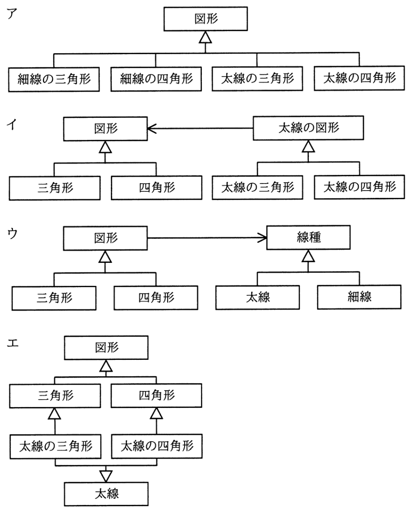

# 令和3年度秋期 問48（開発技術）

## 問題文

図は，ある図形描画ツールのクラス図の一部である。新たな形状や線種で図形を描画する機能の追加を容易にするために，リファクタリング“継承の分割”を行った。変更後のクラス図はどれか。

## 使用画像

## 解答と解説

**正解：ウ**

変更前のクラス図では、「三角形」「四角形」がそれぞれ「太線の三角形」「太線の四角形」を継承しており、形状と線種という二つの独立した性質が一つの継承階層に混在している。このままでは、線種（太線・細線）や図形の種類が増えるたびにクラス数が組み合わせ的に増加してしまう。

「継承の分割（Extract Hierarchy／継承の分離）」というリファクタリングは、こうした複数の変化の観点（この場合は「図形の種類」と「線の太さ」）を別々の継承階層に分離することを指す。ウの図では、「図形」から「三角形」「四角形」への継承階層と、「線種」から「太線」「細線」への継承階層を分離し、「図形」と「線種」を関連（コンポジションに相当する矢印）で結んでいる。これにより、新しい図形や新しい線種を追加する際に、それぞれ独立して1クラス追加するだけで済むようになり、拡張が容易になる。

- ア　継承階層を分割しておらず、図形と線種の全組み合わせを個別クラスとして列挙しているため、組み合わせが増えるたびにクラスが増加してしまい改善になっていない。
- イ　「太線の図形」という中間クラスを図形クラスから継承させる形にしているが、依然として図形と線種の組み合わせごとにサブクラスが必要であり、線種の追加に弱い。
- エ　変更前とほぼ同じ構造に「太線」クラスへの関連を追加しただけで、継承の分割にはなっていない。

**IPA公式：ウ**
