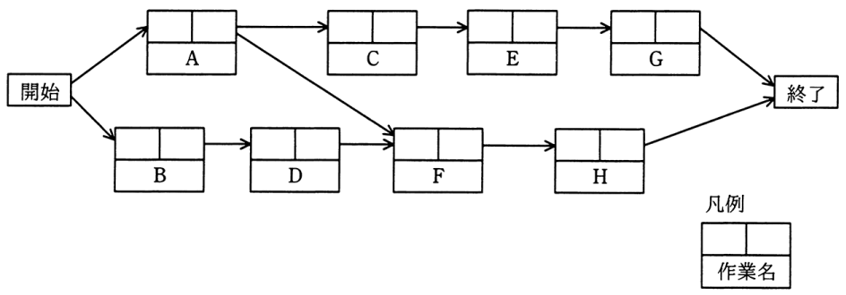
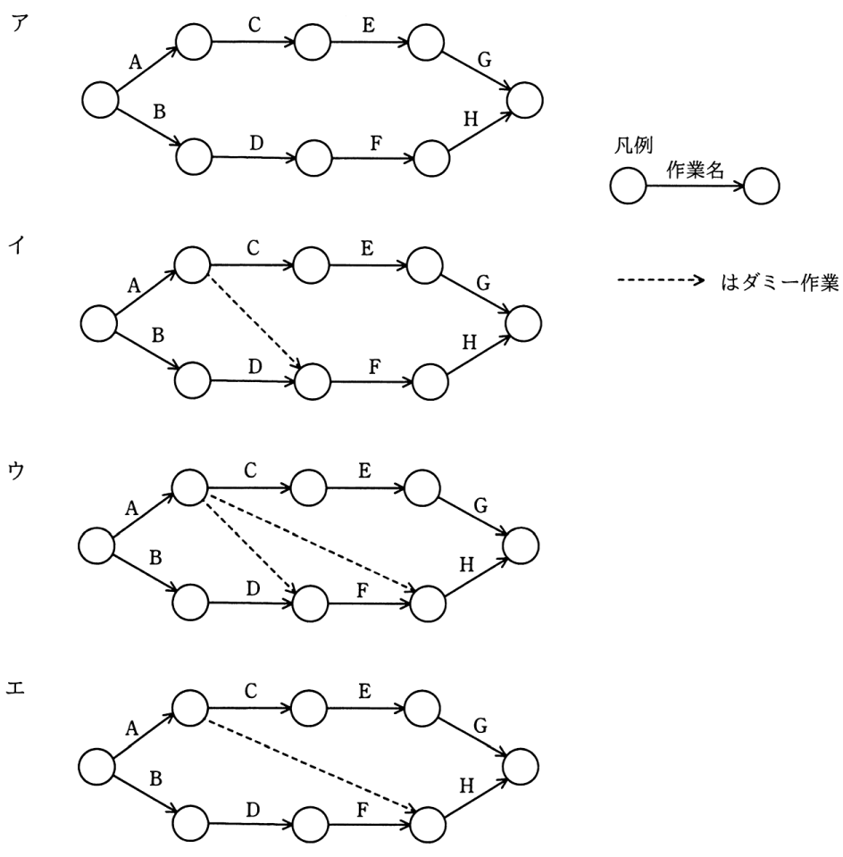

# 令和3年度秋期 問52（マネジメント）

## 問題文

次のプレシデンスダイアグラムで表現されたプロジェクトスケジュールネットワーク図を，アローダイアグラムに書き直したものはどれか。ここで，プレシデンスダイアグラムの依存関係は全てFS関係とする。

## 使用画像

## 解答と解説

**正解：イ**

プレシデンスダイアグラムでは、開始からA・Bが並行して始まり、AはC（→E→G）とFの両方へ向かい、BはD→Fへ向かう。つまり作業Fは「A」と「D」の両方が完了して初めて開始できる（AとDの合流点）。

アローダイアグラムでは、一つのノードから出せる矢印は実際の作業だけであり、Fの開始条件である「Aの完了」と「Dの完了」を同時に表すには、実体のない「ダミー作業」（点線矢印、所要時間ゼロ）を使ってA完了のノードとD完了のノードを結び、依存関係だけを表現する必要がある。図イは、A→C の分岐点からダミー作業（点線）でD→Fのノードへ接続しており、Fの開始にはAとDの両方の完了が必要という条件を過不足なく表現できている。

- ア　ダミー作業が全くなく、AとFの依存関係が表現されていないため、プレシデンス図の依存関係（AがFの前提条件であること）が欠落している。
- ウ　ダミー作業が3本引かれており、G・Hへの依存関係まで誤って追加されてしまっているため、余分な制約を表してしまっている。
- エ　ダミー作業の始点・終点の位置が誤っており、CとEの間のノードからHへ直接ダミーが引かれているなど、A→Fの依存を正しく表現できていない。

**IPA公式：イ**
