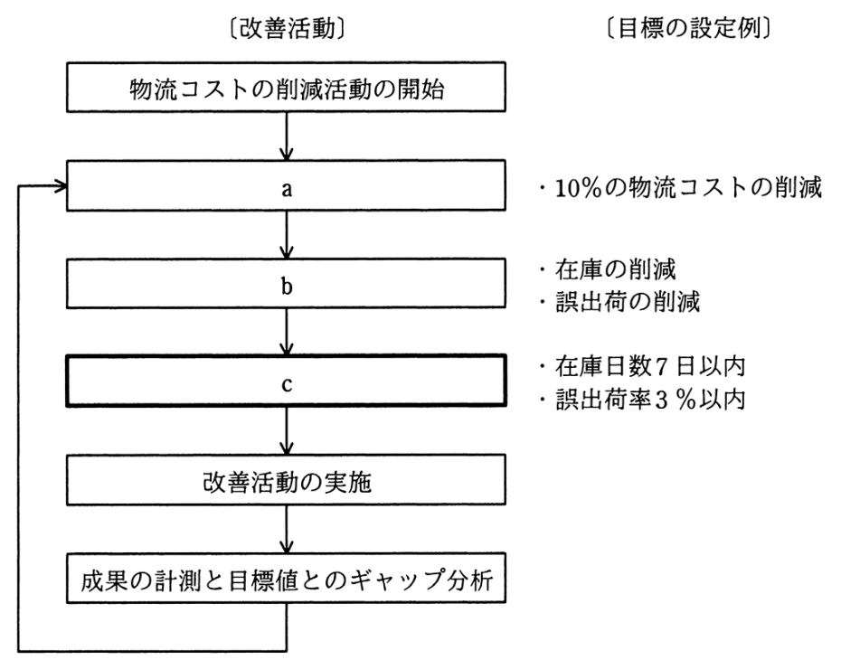

# 令和3年度秋期 問62（ストラテジ）

## 問題文

物流業務において，10％の物流コストの削減の目標を立てて，図のような業務プロセスの改善活動を実施している。図中のcに相当する活動はどれか。

ア　CSF（Critical Success Factor）の抽出

イ　KGI（Key Goal Indicator）の設定

ウ　KPI（Key Performance Indicator）の設定

エ　MBO（Management by Objectives）の導入

## 使用画像

