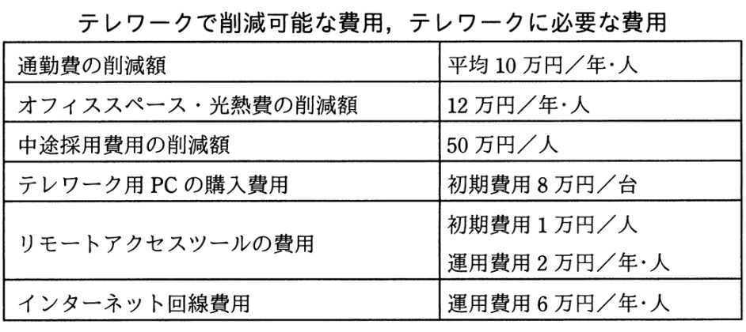

# 令和3年度秋期 問64（ストラテジ）

## 問題文

A社は，社員10名を対象に，ICT活用によるテレワークを導入しようとしている。テレワーク導入後5年間の効果（“テレワークで削減可能な費用”から“テレワークに必要な費用”を差し引いた額）の合計は何万円か。

〔テレワークの概要〕

・テレワーク対象者は，リモートアクセスツールを利用して，テレワーク用PCから社内システムにインターネット経由でアクセスして，フルタイムで在宅勤務を行う。

・テレワーク用PCの購入費用，リモートアクセスツールの費用，自宅・会社間のインターネット回線費用は会社が負担する。

・テレワークを導入しない場合は，育児・介護理由によって，毎年1名の離職が発生する。フルタイムの在宅勤務制度を導入した場合は，離職を防止できる。離職が発生した場合は，その補充のために中途採用が必要となる。

・テレワーク対象者分の通勤費とオフィススペース・光熱費が削減できる。

・在宅勤務によって，従来，通勤に要していた時間が削減できるが，その効果は考慮しない。

ア　610

イ　860

ウ　950

エ　1,260

## 使用画像

## 解答と解説

**正解：イ**

社員10名・5年間の効果を、削減できる費用と必要な費用に分けて計算する。

〔削減可能な費用（5年間・10名分）〕
- 通勤費の削減額：10万円/年・人 × 10人 × 5年 = 500万円
- オフィススペース・光熱費の削減額：12万円/年・人 × 10人 × 5年 = 600万円
- 中途採用費用の削減額：離職は年1名発生するはずだったものがテレワーク導入で防止できるため、50万円/人 × 1人 × 5年 = 250万円

削減額合計：500 + 600 + 250 = 1,350万円

〔テレワークに必要な費用（5年間・10名分）〕
- PC購入費用（初期）：8万円/台 × 10台 = 80万円
- リモートアクセスツール初期費用：1万円/人 × 10人 = 10万円
- リモートアクセスツール運用費用：2万円/年・人 × 10人 × 5年 = 100万円
- インターネット回線費用：6万円/年・人 × 10人 × 5年 = 300万円

必要費用合計：80 + 10 + 100 + 300 = 490万円

〔5年間の効果〕
1,350 − 490 = 860万円

よって正解はイである。

**IPA公式：イ**

