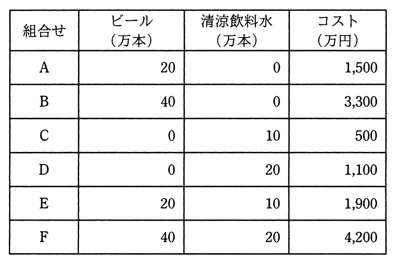

# 令和3年度秋期 問68（ストラテジ）

## 問題文

あるメーカがビールと清涼飲料水を生産する場合，表に示すように6種類の組合せ（A〜F）によって異なるコストが掛かる。このメーカの両製品の生産活動におけるスケールメリットとシナジー効果に関する記述のうち，適切なものはどれか。

ア　スケールメリットはあるが，シナジー効果はない。

イ　スケールメリットはないが，シナジー効果はある。

ウ　スケールメリットとシナジー効果がともにある。

エ　スケールメリットとシナジー効果がともにない。

## 使用画像

## 解答と解説

**正解：イ**

表の数値からスケールメリット（規模の経済）とシナジー効果（相乗効果）の有無を確認する。

〔スケールメリットの検証〕
単独生産の単位当たりコストが、生産量の増加によって下がるかを見る。
- ビールのみ：A（20万本, 1,500万円）→ 75円/本、B（40万本, 3,300万円）→ 82.5円/本。生産量を2倍にしてもコストは2倍以上（1,500×2=3,000 < 3,300）になっており、単位コストはむしろ上昇している。
- 清涼飲料水のみ：C（10万本, 500万円）→ 50円/本、D（20万本, 1,100万円）→ 55円/本。同様にC×2=1,000 < 1,100で、単位コストは上昇している。

つまり生産量を増やしてもコストが比例以下では下がらず、むしろ割高になっているため、スケールメリットはない。

〔シナジー効果の検証〕
別々に生産する場合の合計コストと、同時に生産する場合のコストを比較する。
- A（ビール20万本）+C（清涼飲料水10万本）を別々に作るとコストは1,500+500=2,000万円。これを同時に生産するE（ビール20万本, 清涼飲料水10万本）は1,900万円で、別々に作るより100万円安い。

したがって、両製品を同時に生産することでコストが下がる＝シナジー効果があるといえる。

以上より、「スケールメリットはないが、シナジー効果はある」イが正解である。

**IPA公式：イ**

