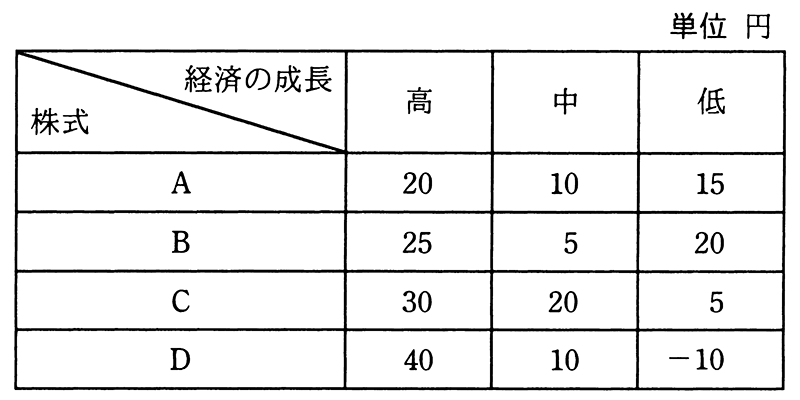

# 令和3年度秋期 問75（ストラテジ）

## 問題文

いずれも時価100円の株式A〜Dのうち，一つの株式に投資したい。経済の成長を高，中，低の三つに区分したときのそれぞれの株式の予想値上がり幅は，表のとおりである。マクシミン原理に従うとき，どの株式に投資することになるか。

ア　A

イ　B

ウ　C

エ　D

## 使用画像

## 解答と解説

**正解：ア**

マクシミン原理（maximin：最悪の場合を想定し、その中で最も結果が良い選択肢を選ぶ悲観的な意思決定基準）に従う場合、各株式について起こりうる最悪の値上がり幅（最小値）を求め、その最小値が最も大きいものを選ぶ。

表の各株式の最小値（悲観値）は次のとおり。
- A：高20, 中10, 低15 → 最小値は10
- B：高25, 中5, 低20 → 最小値は5
- C：高30, 中20, 低5 → 最小値は5
- D：高40, 中10, 低−10 → 最小値は−10

最小値同士を比較すると、Aの10円が最も大きい。したがって、マクシミン原理に従うとAに投資することになる。

**IPA公式：ア**

