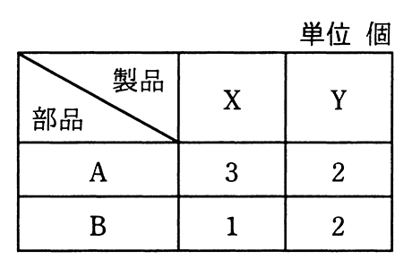

# 令和3年度秋期 問76（ストラテジ）

## 問題文

製品X，Yを1台製造するのに必要な部品数は，表のとおりである。製品1台当たりの利益がX，Yともに1万円のとき，利益は最大何万円になるか。ここで，部品Aは120個，部品Bは60個まで使えるものとする。

ア　30

イ　40

ウ　45

エ　60

## 使用画像

## 解答と解説

**正解：ウ**

製品Xの製造にはA部品3個・B部品1個、製品Yの製造にはA部品2個・B部品2個が必要である。製品Xの製造台数をx、Yの製造台数をyとすると、制約条件は次のとおり。

- 部品A：3x + 2y ≤ 120
- 部品B：x + 2y ≤ 60
- x ≥ 0, y ≥ 0

利益はx、yともに1万円/台なので、目的は「x+y の最大化」である。

2式の交点を求めると、(3x+2y=120) − (x+2y=60) より 2x=60、x=30。これをx+2y=60に代入すると 2y=30、y=15。このとき部品Aは3×30+2×15=90+30=120（上限ちょうど）、部品Bは30+2×15=60（上限ちょうど）で両方の制約を満たす。

このときの利益はx+y=30+15=45万円。

境界上の他の頂点（x=40,y=0で利益40／x=0,y=30で利益30）と比較しても、(x,y)=(30,15)のときが最大となる。

よって最大利益は45万円で、正解はウである。

**IPA公式：ウ**

