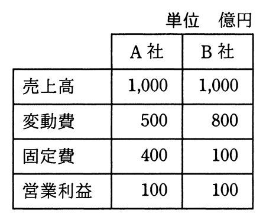

# 令和3年度秋期 問77（ストラテジ）

## 問題文

A社とB社の比較表から分かる，A社の特徴はどれか。

ア　売上高の増加が大きな利益に結び付きやすい。

イ　限界利益率が低い。

ウ　損益分岐点が低い。

エ　不況時にも，売上高の減少が大きな損失に結び付かず不況抵抗力は強い。

## 使用画像

## 解答と解説

**正解：ア**

A社・B社ともに売上高1,000億円、営業利益100億円と結果は同じだが、費用構造（固定費と変動費の内訳）が大きく異なる。

〔A社〕変動費500、固定費400
- 限界利益（売上高−変動費）＝1,000−500＝500億円
- 限界利益率＝500／1,000＝50％
- 損益分岐点売上高＝固定費／限界利益率＝400／0.5＝800億円

〔B社〕変動費800、固定費100
- 限界利益＝1,000−800＝200億円
- 限界利益率＝200／1,000＝20％
- 損益分岐点売上高＝100／0.2＝500億円

A社は固定費の比率が高く限界利益率が高いため、損益分岐点は800億円とB社より高いが、いったん損益分岐点を超えると売上高の増加分の50％がそのまま利益に積み上がる（ハイリスク・ハイリターン型の費用構造）。一方でB社は損益分岐点が低く不況に強い（不況抵抗力が強い）が、売上増加が利益に結び付く割合（限界利益率20％）はA社より小さい。

したがって、「売上高の増加が大きな利益に結び付きやすい」というアがA社の特徴として正しい。イ（限界利益率が低い）・ウ（損益分岐点が低い）・エ（不況抵抗力が強い）はいずれもB社の特徴であり、A社には当てはまらない。

**IPA公式：ア**

