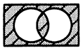
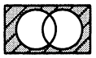
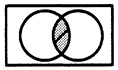
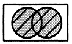

# 令和3年度春期 問1（基礎理論）

## 問題文

任意のオペランドに対するブール演算Aの結果とブール演算Bの結果が互いに否定の関係にあるとき，AはBの（又は，BはAの）相補演算であるという。排他的論理和の相補演算はどれか。

ア　等価演算（）

イ　否定論理和（）

ウ　論理積（）

エ　論理和（）

## 使用画像

## 解答と解説

**正解：ア**

相補演算とは，任意の入力に対して出力が常に反転（否定）の関係になる演算のことである。排他的論理和（XOR）は2つの入力が異なるときに1を出力する演算なので，その相補演算は「2つの入力が等しいときに1を出力する」演算，すなわち等価演算（XNOR，一致回路）である。

ベン図（2つの円A，Bを重ねた図）で考えると，XORが表す領域は「AとBの重なり（積集合）を除いた部分（対称差）」である。その否定であるXNORは，ちょうど反対側の領域，つまり「AとBの重なり部分」と「AにもBにも属さない外側の部分」を合わせた領域になる。

4つの図を見ると，アの図は円の重なり部分と円の外側（背景）がともに網掛けされ，2つの円それぞれの重ならない部分（排他的な弧の部分）だけが白く抜けている。これはまさにXNORの領域を表しており，正解はアの等価演算である。なお，イは外側だけが網掛けされており否定論理和（NOR），ウは重なり部分だけが網掛けされており論理積（AND），エは2つの円の内部全体（重なりを含む）が網掛けされており論理和（OR）を表す図である。

**IPA公式：ア**

