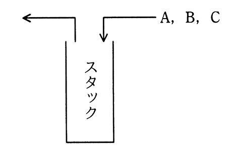

# 令和3年度春期 問5（基礎理論）

## 問題文

A，B，Cの順序で入力されるデータがある。各データについてスタックへの挿入と取出しを1回ずつ行うことができる場合，データの出力順序は何通りあるか。

ア　3

イ　4

ウ　5

エ　6

## 使用画像

## 解答と解説

**正解：ウ**

A，B，Cの順にスタックへ挿入（push）し，任意のタイミングで取出し（pop）できる場合，可能な出力順序（スタック順列）の総数はカタラン数 C_n＝(2n)!／{(n+1)!n!} で求められる。n＝3のとき，C_3＝(2×3)!／(4!×3!)＝720／(24×6)＝5通りである。

実際に列挙すると，ABC，ACB，BAC，BCA，CBAの5通りが可能であり，CABの順序だけはスタックの構造上実現できない（Cを先に取り出すにはA，Bを先に積んでいる必要があるため，Cの直後にAは取り出せない）。したがって出力順序は5通りであり，正解はウである。

**IPA公式：ウ**
